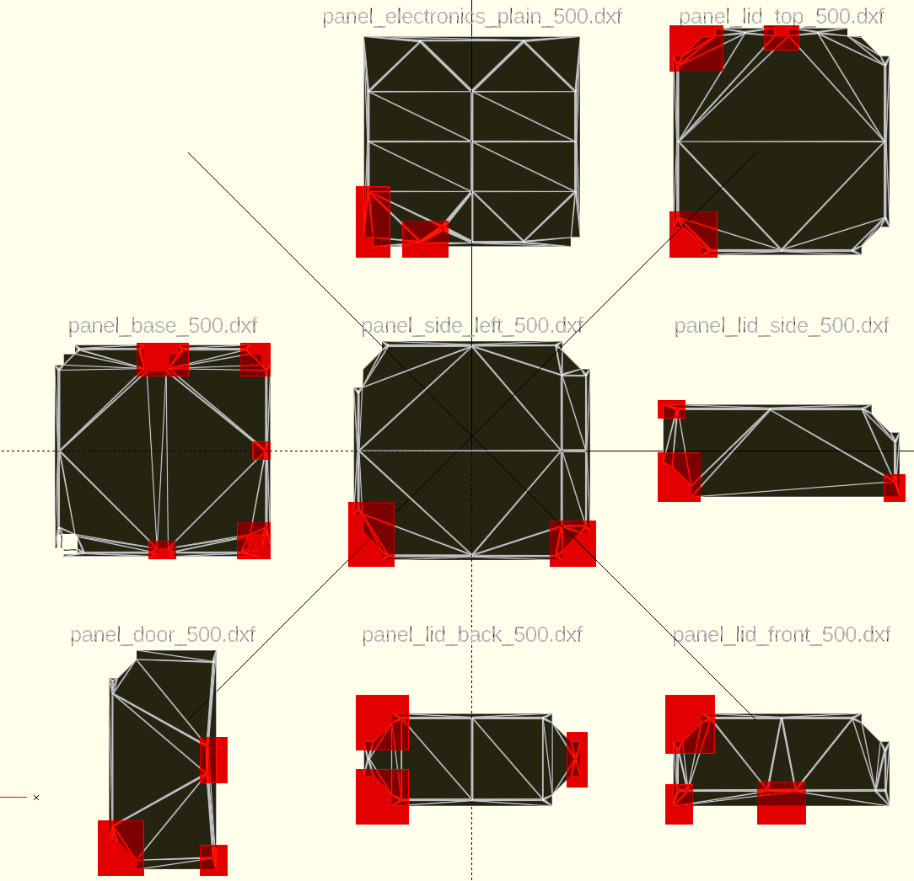

# V-Core 3 Template Extractor SCAD

## What this is

An OpenSCAD file allowing to extract areas of the panels of the V-Core 3 enclosure, to be for example 3d printed as router templates.

The result is provided in the output dir for convenience.

Some of the templates are redundant or almost-redundant, it is up to you to decide which ones you actually need by comparing them.

## Template locations

## How to use the SCAD file

  - Drop inside the directory of the DXF files
  - Verify that with the default .scad file provided the extractions shown in openscad are in the correct locations
  - Comment the last line (call to "select")
  - Execute the extraction with make_stl.py v-core-3-500-panel-templates.scad

## Features

  - Allows always matching the latest DXFs
  - Prevents human error by automating the act of transposing DXF measurements to the 3d models
  - Uses a (slightly clunky) quadrant system to indicate the overall location of each extraction
  - Auto-rotates text when on a side quadrant
  
## Possible improvements

  - Visually indicate the quadrant, and the panel edges for alignment.
  - Check that this is compatible with the 300 and 400 version
  
## License

Script is GPLv3 (https://www.gnu.org/licenses/gpl-3.0.en.html)
STL Files are whatever is compatible with the original licenses of the DXF files from RatRig
